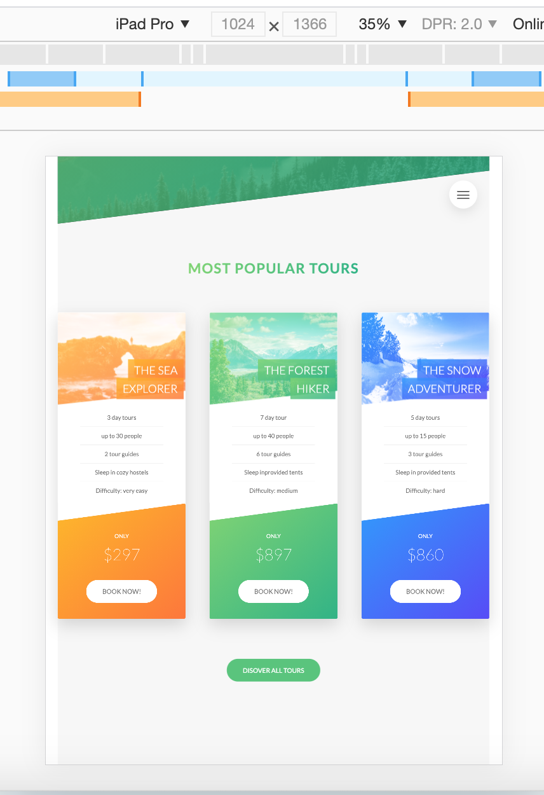
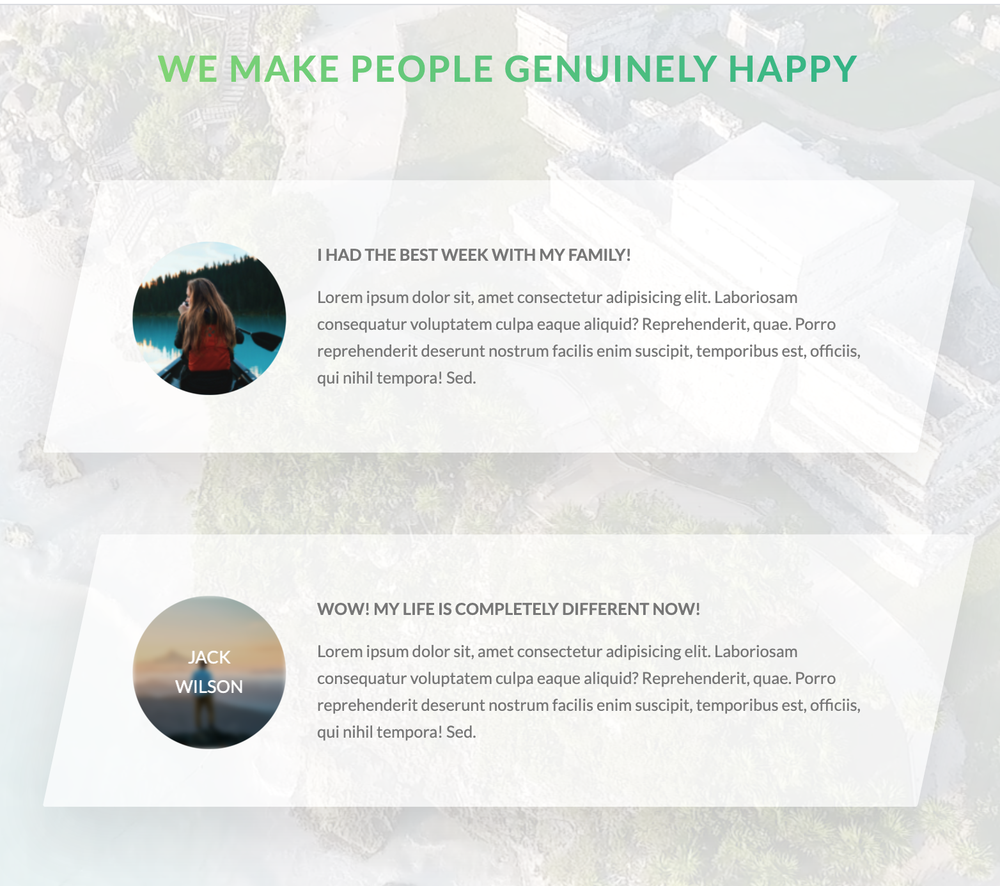
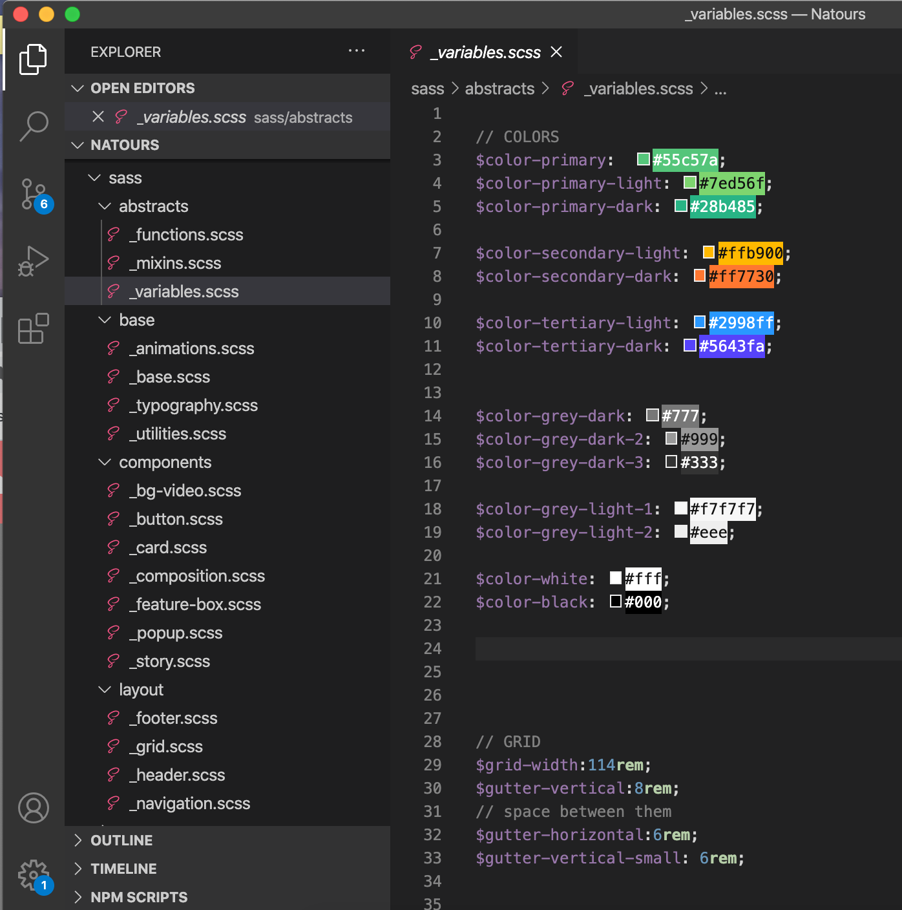

# [Natours](https://zahraaliaghazadeh.github.io/Natours/index.html)
>Exciting tours for adventurous people


###  Natours is built with HTML , CSS and SASS ( SCSS )

## Table of contents
* [General info](#general-info) 
* [Screenshots](#screenshots) 
* [Installation](#installation) 
* [Usage](#usage)
* [Credits](#credits)
* [Features](#features) 
* [Status](#status) 
* [License](#license) 
* [Contributers](#contributers)


## General Info

> This application 's concept is to schedule tours and out door activities. This repository consist of mostly SCSS files for design and animations of the app.


## Screenshots

  


## Installation
To install:
* [Visual Code](https://code.visualstudio.com/docs/setup/setup-overview)

After downloading the files, use ```npm install``` command to install the packages.


## Usage 

To use this application, you can [click here](https://zahraaliaghazadeh.github.io/Natours/index.html).

Upon clicking on the link above, you can view the UI design of the app.


## Credits

Source code from Udemy course by Jonas Schmedtmann

video  [coverr](https://www.coverr.co)
images  [unsplash](https://www.unsplash.com)


## npm packages used
* [concat](https://www.npmjs.com/package/concat)
* [autoprefixer](https://www.npmjs.com/package/autoprefixer)
* [postcss](https://www.npmjs.com/package/postcss)

## Features
List of features:
* Feature 1: Easy to navigate design.
* Feature 2: Incredibly organized file structure for layout, components, base, abstracts, etc.
* Feature 3: very modern look and animations built with advanced CSS.
* Feature 4: compiled code with npm packages to reduce its size.
* Feature 5: fully responsive app, including the icon, font-size and images.


To-do list:
* a. Adding functionality to the application.


## Status
Project is:  _finished_

#### Inspiration
Learning SASS (SCSS) , advanced CSS and HTML for better UI design.


## License

MIT license 
Copyright © 2020 Zahra Ali Aghazadeh 


## Contributors

Feel free to contact me via linkedIn for any feedbacks, questions or collaborations! 


 <br>
Yalda Ali Aghazadeh : Project Manager / Front End Developer/ Designer
[Github](https://github.com/zahraaliaghazadeh) ,
[LinkedIn](https://www.linkedin.com/in/zahraaliaghazadeh/)


